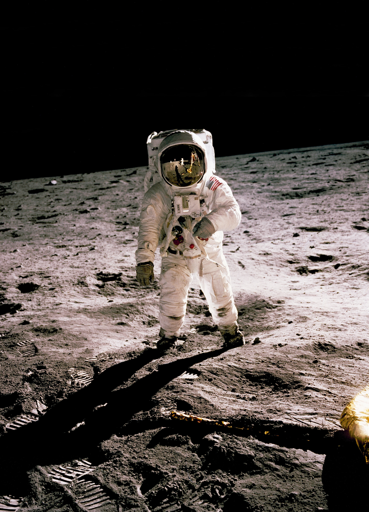

Llevo tiempo con la idea de montarme un blog para hablar de desarrollo principalmente pero también de cualquier otra cosa que se me ocurra (videojuegos, cine, libros, internet...)

>En realidad no es más que una excusa para ponerme a escribir y al mismo tiempo practicar Gatsby en general y GraphQL, React y otros en particular.

Probablemente lo que aquí escriba acabará en Medium, pero no quiero que ninguna plataforma comercial tenga los originales. Para eso escribo este blog, con la idea de que sea la plataforma principal y Medium sea el medio (jeje) para hacer eco.

>Espero que la gente de Forestry se ponga las pilas con el soporte para Gatsby.

Queda mucho por hacer:

* Diseñar, diseñar, diseñar.
* Implementar funcionalidades:
  * Tags
  * About, Contact
  * Alguna cosilla más que me dejo en el tintero.

Me gusta mucho la idea de que Gatsby esté basado en React. De este modo lo tengo todo más fácil y me puedo centrar en GraphQL y md, que es otra pequeña tarea que tenía pendiente para ponerme al día en CMS modernos.

Y bueno, esto es todo. Ni siquiera este post es final, pero como todavía no está implementado el sistema de borradores, así se queda y ya lo iré mejorando durante la semana.

> Me gusta esto de tener un blog.

Para cerrar, una imagen de Neil Armstrong en la luna. *Let there be light*.

Créditos: History in HD en Unsplash.